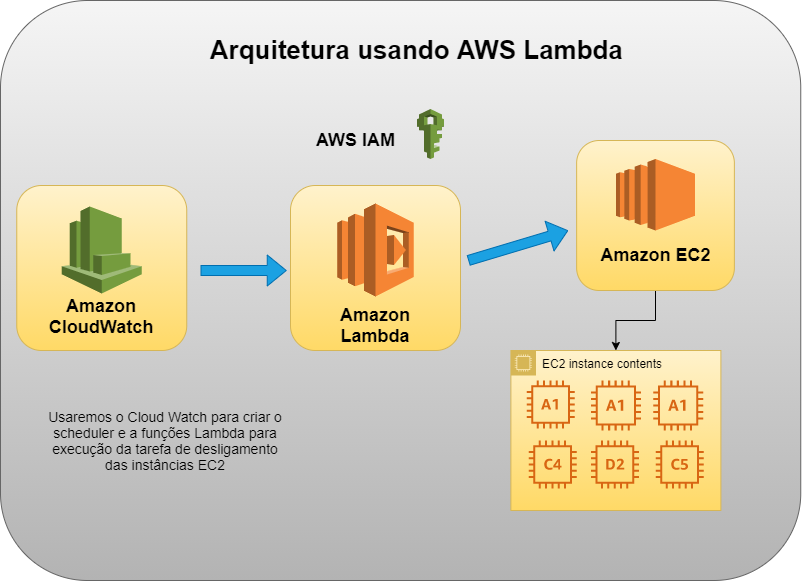

  

<h2 align="center">
  Neon Cloud Analyst - Theory
</h2>

## ➤ Info

### General

- 👥 Name: Lucca Pessoa da Silva Matos

### Personal

- 💻 Website: [here](https://linktr.ee/lpmatos)
- 💻 GitHub: [@lpmatos](https://github.com/lpmatos)
- 💻 GitLab: [@lpmatos](https://gitlab.com/lpmatos)
- 💻 Linkedin: @[luccapessoa](https://www.linkedin.com/in/luccapessoa)

## ➤ Overview

O intuito desse documento é colocar todas as informações e respostas referentes ao exame dissertativo proposto para vaga de **Analista Cloud Pleno** na **Neon**.

## ➤ Questions

### Em uma demanda onde teremos altíssimo volume de dados para ser coletado e processado em REAL-TIME, qual solução da AWS mais pertinente e por quê?

Apesar de nunca ter tido experiência com nenhuma solução da **AWS** para cenários de altíssimo volume de dados para coleta e processamento em real time, já montei uma **POC** ([GitHub](https://github.com/lpmatos/twitter-realtime-processing-covid)) de projeto para coleta de dados em real-time do twitter e os enviava para o **Elasticsearch**, usando:

- **Apache Kafka**
- **Elastic Stack (Elastichsearch + Kibaba)**
- **Python**

Falando desse cenário na AWS para uma demande com altíssimo volume de dados (ou seja, processamento de big data) e processamento em REAL-TIME (ou seja, análise em tempo real), podemos utilizar os serviços:

- AWS Kinesis
    - Amazon Kinesis Data Streams
    - Amazon Kinesis Data Analytics
- AWS EMR

### Você foi designado para criar uma rotina de desligamos de todas as instâncias de ambiente de laboratório e desenvolvimento às 20:00 horas e religá-las às 08:00 horas durante segunda-sexta. Qual seria a estratégia com menor esforço administrativo para implementação dessa rotina (dê detalhes)?

No maravilhoso mundo da cloud um dos principais pontos positivos que temos é provisionamento sob demanda. Sempre que um recurso é realmente necessário nós provisionamos aquela infraestrutura, pagando apenas por aquela utilização (**pay-per-use**), e quando não estamos mais utilizando ela, conseguimos facilmente destruí-la.  Ambientes de **Desenvolvimento**, **Labs** e até mesmo **QA**, não são ambientes que precisam de política de **alta disponibilidade**, como a maioria dos ambientes **Produtivos**, sendo muitas vezes usados apenas em horário comercial. Portanto, não faz sentido termos esses ambientes disponíveis **24/7**, até mesmo por questão de custo. Utilizar os conceitos que a cloud prega de infraestrutura sob demanda é mais recomendado caso você queira otimizar seus custos e melhorar sua estratégia em arquiteturas cloud.

Pensando em um cenário empresarial, quando optamos por utilizar um provedor de cloud público, estamos sujeito a um **billing** atrelado aos recursos criados e utilizados por nós. Se não soubermos controlar esse **billing** e definir o que é realmente importante para aquele ambiente, poderemos no final do mês pagar um valor extremamente alto e que não condiz com a realizada que esperamos. Mesmo usando ferramentas externas para dar maior visibilidade para o gerenciamento da sua conta no seu provedor de cloud, como **[Cloudcheckr](https://cloudcheckr.com/)** ou **[Spot](https://spot.io/)**, deve existir um trabalho manual para a criação de processos e boas práticas que controle isso. Um dos cenários que temos nesse contexto é o de rotina de desligamento de máquinas (instâncias virtuais) e é o que será aprofundado nessa resposta.

Na **AWS** o recurso que disponibiliza capacidade de poder computacional é o **[Amazon Elastic Compute Cloud](https://aws.amazon.com/pt/ec2/?ec2-whats-new.sort-by=item.additionalFields.postDateTime&ec2-whats-new.sort-order=desc) (EC2)**, onde podemos dizer que é um tipo de máquina provisionada para você realizar alguma atividade. Existem diversos tipos de instâncias para você utilizar, separadas de acordo com a recomendação de utilização para determinado cenário (cabe a você nesse momento possuir o conhecimentos sobre os tipos de instância ofertadas e selecionar os tipos que se enquadram para sua realidade). Ter um processo que faça o desligamento das instâncias que estão rodando em sua conta é um tremendo avanço para controlar seus gastos e tornar seu processo de gerenciamento mais maduro.

Existem várias formas para você agendar o desligamento/ligamento de servidores e no mundo de cloud isso não é diferente. Pensando na **AWS**, você também terá diversas formas de se fazer isso, inclusive se você for no seu **marketplace** alguns parceiros oferecem produtos para isso, porém possui custos adicionais. Ampliando nosso pensamento, podemos automatizar esse processo utilizando ou não ferramentas nativas da **AWS**. Aqui estão alguns maneiras de realizar essa atividade:

#### Ferramentas Externas

- Cria um **script** simples (em **Python**, **Ruby**, **Shell Script**... se tiver suporte ao **[SDK](https://aws.amazon.com/pt/tools/)** da **AWS**, melhor) que faça o filtro das instâncias desejadas (aqui você pode optar por utilizar tags, definindo estratégias de nomenclatura para cada disponibilidade desejada), configurar a máquina para rodar o script, instalar os pacotes necessários e criar uma rotina (**crontab**) de disparado do script. O maior ponto negativo dessa abordagem, na minha visão, é que estaremos colocando mais uma instância para podermos gerenciar, não gerando um menor esforço administrativo.
- Segue a mesma lógica de criação do **script**, porém o mesmo rodará usando o **[GitLab CI](https://docs.gitlab.com/ee/ci/)** ([Schedulers](https://docs.gitlab.com/ee/ci/pipelines/schedules.html)) para disparar o script + [**GitLab Runner**](https://docs.gitlab.com/runner/) para provisionar o ambiente de execução do job. Nessa abordagem teremos uma facilidade na administração, porém a criação tera uma complexidade extremamente alto e estaremos colocando mais barreiras no nosso processo de administração e gerenciamento.

#### Ferramentas AWS

- Segue a mesma lógica de criação do **script**, porém utilizando as [**funções Lambda**](https://aws.amazon.com/pt/lambda/) da **AWS** (para execução) em conjunto com o **[CloudWatch](https://aws.amazon.com/pt/cloudwatch/)**  (para o disparo) + uma padronização de nomenclatura de tags para as instâncias **EC2** (para filtragem). De longe a estratégia mais fácil é a que envolve as **funções Lambda** da **AWS**.

Ao utilizar as **funções Lambda** da **AWS** não precisaremos nos preocupar com o provisionamento de nenhum tipo de infraestrutura e teremos uma facilidade tremenda para implementação. 

Uma **função Lambda** executa o código somente quando existe um gatilho de disparo. Durante essa gatilho é dimensionado automaticamente o ambiente para rodar aquele código. Se não existir o gatilho de disparo, então a função não é executada e você não paga nada. Outro ganho que podemos colocar ao utilizar essa forma é que estaremos utilizando ferramentas nativas da **AWS** para a criação do processo, não existindo nenhuma interação com ferramentas externas. 

A redução de custos que essa estratégia vai trazer é gigante! Ainda mais se levarmos em consideração o tipo de instância utilizada no ambiente. 

  

#### Serviços Utilizados

- **Amazon Lambda**
    - Serviço [serveless](https://aws.amazon.com/pt/serverless/) da **AWS**.
- Instância **EC2**
    - São as máquinas na sua conta.
- **Amazon CloudWatch**
    - Serviço da **AWS** de **monitoramento** e **observação**. Com ele conseguimos coletar dados e visões precisas para o monitoramento de aplicações, além de conseguir responder a alterações em todo seu sistema (**CloudWatch Events**). Nesse contexto utilizaremos como configuração do gatilho pré-definido pelo usuário para o desligamento das máquinas em um horário específico.

Caso se interessem, tenho o exemplo de código no meu [GitHub](https://github.com/lpmatos/lambda-aws-ec2)! Fico feliz em poder compartilhar! 

### Alguns membros do time de banco de dados da Neon tem reclamado de problemas de performance nos Bancos Maria DB que rodam em RDS. Como iniciar um troubleshooting disso? Quais ferramentas utilizar?

Antes de entrarmos na resposta e falarmos sobre esse **troubleshooting** para o cenário proposto com o **[Amazon Relational Database Service](https://docs.aws.amazon.com/rds/index.html) (RDS)**, acho interessante abordarmos algumas definições.

O **MariaDB** é um dos **SGBD's** (**Sistema Gerenciador de Banco de Dados**) mais utilizados pela comunidade, possuindo seu core de implementação em cima do **MySQL,** outro **SGDB** bastante conhecido e que tem o código aberto.  Uma das características mais chamativas do **MariaDB** é a rapidez, os plugins, escalabilidade e capacidade de armazenamento, por isso é amplamente utilizado. Podemos definir um **banco de dados** como uma caixinha de informações que se relacionam e criam um sentido ligado a uma regra negócio específica. Definir se na sua arquitetura precisa de um **SGDB**  e escolher qual **SGDB** usar, é um fator crítico para disponibilidade e desempenho de aplicações que vão sustentar a operação de sua empresa. Sendo assim, entender o propósito da sua aplicação e o poder computacional que estará associado ao seu ambiente é fundamental quando estamos falando de desenvolvimento de aplicações em modernas, escaláveis e de alta disponibilidade, principalmente em um modelo onde a infraestrutura do ambiente é em cloud. Nós sabemos que a qualidade de entrega de algum serviço é extremamente importante nos dias atuais e é indispensável caso você queira lançar um produto em produção que possui um público alvo grande, pois ai existirá uma preocupação com a escalabilidade dos aplicativos. Às vezes estamos construindo coisas que são tão onipresentes e tão grandes que é difícil entendermos o fato de que todos os usuários usam a mesma linha de código e estão na mesma arquitetura de ambiente. Possuir um bom monitoramento e políticas de execução de teste de **carga/stress** é extremamente recomendado caso você queira encontrar gargalos em sua aplicação, tanto a nível da infraestrutura, quanto a nível de código/configuração.

Voltando para o cenário proposto, o **RDS** é serviço que visa facilitar a criação, configuração e operação de **banco de dados relacionais** na **AWS.** Com ele é simplificado todo o processo de gestão, delegando as atividades de instalação, configuração, operação e escalonamento para a própria **AWS**. Existe uma série de features que fazem com que o **RDS** seja mais rentável e recomendado quando decidimos usar um **banco de dados relacional** em cloud. Quando você cria um **RDS** o que você está fazendo é provisionar uma instância de **banco de dados**, não uma instância tipo **EC2**, que está totalmente isolada da **AWS**. Como todo processo de gestão do **RDS** é feito pela **AWS**, cabe a você configurar um monitoramento e habilitar alguns recursos da própria **AWS** para ter maiores *insights*. Portanto, nessa perspectiva o monitoramento é uma realidade extremamente importante, sendo indispensável para manter a confiabilidade e o desempenho de qualquer solução, tanto em uma infraestrutura comum, quanto em uma infraestrutura em cloud na **AWS**. 

Partindo do pressuposto que temos que realizar um **troubleshooting** em um **RDS (Maria DB)** que apresenta problemas de performance, antes precisamos validar nosso monitoramento na **AWS,** para que ai depois seja feito uma comunicação com o time de desenvolvimento, trazendo todas as métricas e informações colhidas, afim de validar se aquele problema não seria a nível de código, como por exemplo por conta de uma query não performática.  Em seu plano de monitoramento a coleta de dados é tão necessária, quanto a automatização dos processos. Entender as métricas que integram o **CloudWatch** e o **RDS** auxilia a descobrir possíveis indicativos de problema de performance. 

Para iniciarmos esse **troubleshooting**,  podemos começar pelo próprio console da **AWS,** onde na visão nativa do **RDS** existe uma aba chamada **monitoring**, que colhe algumas métricas e as exibe na sua própria interface, não sendo necessário ir para o **CloudWatch** caso você queira fazer uma análise rápida. Além disso existe uma feature que pode ser habilitada chamada *performance insights,* que é um recurso de ajuste e monitoramento de desempenho do banco de dados. Essa feature ajuda a avaliar rapidamente a carga de um banco e determinar quando e onde executar ações. Com o *performance insights* habilitado conseguimos coletar queyr's que foram realizadas no banco (top 10), tempo que as querys executadas estão gastando, o usuário que executou a query, a utilização de recursos computacionais relacionado a query realizada e outras métricas que irão favorecer seu **troubleshooting**. Habilitar ela requer um custo adicional, porém o valor que ela entrega é muito grande, ainda mais se tratando de banco. Imagina que o banco está com a **CPU** topada e você verificou isso no **CloudWatch**, mas e ai? Apenas com o **CloudWatch** você não consegue muita informação sobre o motivo daquele pico de recurso, diferentemente de quando você habilita o *performance insights*, que permite te pegar a query exata que está sendo executada e identificar se é realmente ela ou não, que está fazendo alto consumo de **CPU**.

Outro aspecto importante desse **troubleshooting** e que está mais ligado a forma como seu monitoramento na **AWS** foi montado, é quando você habilita a parte de eventos com **Amazon Simple Notification Service (SNS)** para fornecer uma notificação assim que ocorre algo no **RDS**, como por exemplo pico de uso de **CPU**. Os eventos fornecem visibilidade da atividade no **RDS**, como **failover**, alterações de configuração ou manutenção. 

O **RDS** também fornece o recurso de **monitoramento aprimorado**, onde conseguimos acesso a métricas em tempo real do **Sistema Operacional (SO)** do **RDS**, possuindo uma granularidade ajustável até um intervalo de monitoramento de um segundo, diferentemente do **CloudWatch**, que possui uma granularidade limitada de um minuto. 

Feito essa abordagem geral sobre o processo de **troubleshooting** e monitoramento de um **RDS** na **AWS**, conclui que as ferramentas nativas da **AWS** para podermos utilizar nesse cenário são:

- Eventos e Notificação de Eventos com **AWS Lambda** + **AWS SNS**

  

- **Monitoramento Aprimorado**
    - Aqui temos uma importante diferença sobre o que é o resultado de uma métrica do **CloudWatch** e o resultado de uma métrica do **Monitoramento Aprimorado**. Primeiro temos que entender quais são as fontes de recuperação dessas métricas. O **CloudWatch** recupera suas métricas de um H**ipervisor**, e não dentro do **SO**, como por exemplo um **Zabbix Agent** que você instala em sua infraestrutura quando está construindo um sistema de monitoramento com **Zabbix**. Isso significa que a nossa visibilidade sobre as métricas de **SO** é limitada pelas métricas disponíveis a nível do H**ipervisor**. Em contra partida, o **Monitoramento Aprimorado** é como se fosse um **Zabbix Agent**, pois realmente usa um agente na instância para relatar as métricas de forma granular, permitindo a coleta a nível do **SO**.
    - Uma das grandes diferenças do **CloudWatch** e o **Monitoramento Aprimorado** é a ideia de **memória liberável**. A **memória liberável** não é um valor que indica realmente quanta memória livre você tem, mas sim a quantidade de memória que poderia estar livre (isso inclui a memória que já é usada em coisas como **cache ou buffer**). Em contraste, a **memória livre** é literalmente a **memória livre**, sendo basicamente o output do comando free, que retorna o quanto de memória está livre no momento. Saber essa diferente é de extrema importância, uma vez que é uma característica nativa de **SGBD's** continuarem alocando memória conforme necessário, sendo uma métrica importantíssima junto com métricas como: **Latência de IO**, **Utilização de CPU** e etc.
- **Performance Insights**
